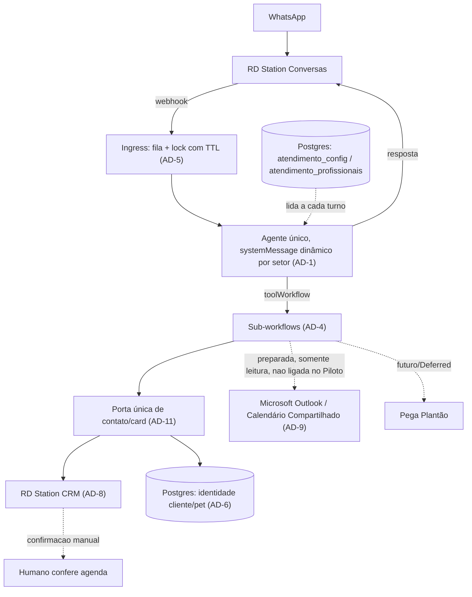
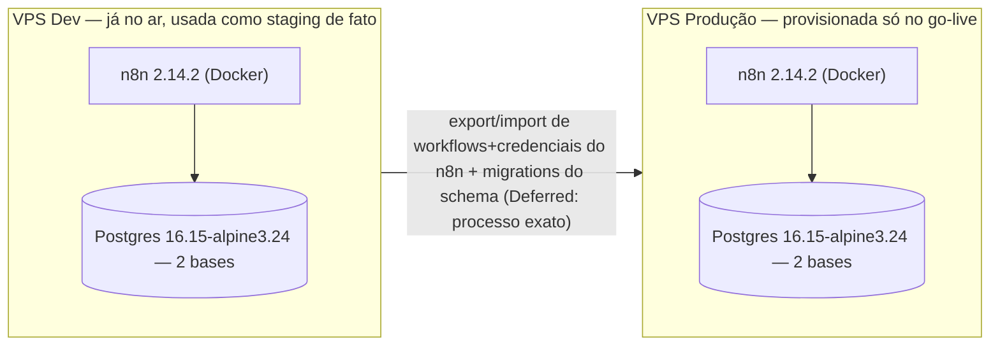

# Architecture Spine — Atendimento Nouvet (Piloto de Recepção)

## Design Paradigm

**Tool-Calling Agent Orchestrator**, implementado sobre primitivas nativas do n8n — validado em produção em projetos anteriores da Btech/Unique (`secretariav3-completo`, ver `n8n-agent-patterns`). Quatro camadas, cada uma um tipo de workflow n8n distinto:

| Camada | Papel | Implementação |
| --- | --- | --- |
| Ingress | Debounce + lock antes do agente ver a mensagem | Workflow de fila (webhook → `n8n_fila_mensagens` → `Wait` → reconsulta) |
| Orquestração | Único ponto de decisão da conversa; nunca chama integração externa direto | Nó `@n8n/n8n-nodes-langchain.agent`, `systemMessage` montado a partir da config lida do Postgres a cada turno (nunca hardcoded, nunca cacheada) |
| Ferramentas | Uma ação = um workflow separado, chamado pelo agente via `toolWorkflow` | Sub-workflows: escalar humano, enviar arquivo, criação de contato/card (AD-11) |
| Integração | Conectores reais, um por sistema externo | RD Station Conversas, RD Station CRM, Microsoft Outlook (Graph, preparado), Postgres de identidade |

**"Recepcionista IA" e "Agente de Setor" (glossário do PRD) são o MESMO nó de agente** `@n8n/n8n-nodes-langchain.agent`, com `systemMessage` e lista de tools remontadas dinamicamente conforme o setor classificado — não são agentes/workflows separados invocados um pelo outro. Um único `session_id` cobre a conversa inteira, incluindo qualquer "handoff" entre Recepção e Setor (o handoff é troca de contexto interna, não uma chamada de agente-como-ferramenta). Decisão tomada para manter um único ponto de leitura de config (AD-1) e um único escopo de memória/lock (AD-5, AD-3), evitando N pontos independentes de implementação da mesma regra. `[CONFIRMADO 02/set/2026 por Thiago]` — a preocupação original não era o número de nós, era custo/tamanho de prompt (por que uma conversa de Care Center carregaria contexto do negócio inteiro?); resolvida pela montagem **seletiva** do `systemMessage` (ver AD-1): antes de classificar o setor, o prompt carrega só o necessário para triagem; a partir da classificação, carrega só a fatia de config daquele setor — nunca um dump de todos os setores de uma vez.

## Invariants & Rules

### AD-1 — Config-as-Data, lida a cada turno [ADOPTED]

- **Binds:** FR-8, FR-16, FR-23, FR-30, FR-31, FR-34, FR-35, FR-41, NFR-2, NFR-5, seção 4.10 (Configuração Externa de Personalização)
- **Prevents:** personalização hardcoded no `systemMessage` do agente ou em nó do n8n (o contraexemplo de referência, `clinica/`, faz exatamente isso — 27KB de texto fixo — e não permite editar tom/regras sem redeploy)
- **Rule:** princípio aberto, não lista fechada — **todo dado que reflete uma regra de negócio do Nouvet (o que pode mudar sem envolver um desenvolvedor), e não uma decisão técnica de implementação, vive em tabela Postgres**, lida por um node dedicado a cada execução do agente, nunca cacheada, nunca em texto fixo. Isso inclui explicitamente, além de tom/dados institucionais/limiares de tempo/sinais de alerta/destinatários de emergência: a lista de exames que exigem anestesia (FR-16), o mapeamento de `stage_id` do funil RD CRM por setor (FR-23, resolve também a lacuna técnica da Questão em Aberto #4 do PRD), e o conteúdo institucional/de serviços que a IA pode citar como fato (**resolve FR-30/FR-31 — Fontes Confiáveis**: no Piloto, "Fonte Confiável" = o mesmo dado de `atendimento_config`/tabela de serviços já lido a cada turno; não há pipeline de RAG/base de conhecimento separada nesta janela de 10 dias — se a IA não tem o dado na config, reconhece incerteza e não responde por inferência, ver FR-31).
- **Montagem do `systemMessage` é seletiva por setor, não cumulativa** `[CONFIRMADO 02/set/2026]`: antes de o turno classificar o setor (fase de Recepção/Triagem), o prompt carrega só o necessário para saudação/identificação/classificação — tom, dados institucionais mínimos, guardrails. A partir do turno em que o setor é classificado, o prompt passa a carregar **só a fatia de config daquele setor** (ex.: regras de Care Center), nunca a config de todos os setores ao mesmo tempo. Isso mantém o custo de token controlável e reduz a superfície de um setor vazar informação de outro (achado do Reviewer Gate/Murat no party mode de 02/set).
- **Gatilho de lembretes/follow-up automático é cron** `[CONFIRMADO 02/set/2026]` (FR-25–29, alimenta SM-3): um workflow independente (`scheduleTrigger`), separado do agente principal, varre `lembretes_horas`/`follow_ups_horas` em `atendimento_config` e o estado em `n8n_status_atendimento`. **Condição obrigatória, não opcional:** antes de disparar qualquer lembrete, o job reconfere se o card/atendimento já foi resolvido por humano — nunca dispara sobre um atendimento já concluído. Sem essa checagem, o mecanismo produz exatamente o que a contra-métrica SM-C2 do PRD probe ("lembrete não pode virar spam percebido").

### AD-2 — Credenciais só no cofre nativo do n8n [ADOPTED]

- **Binds:** FR-43, todas as integrações externas
- **Prevents:** segredo de integração (estático ou rotativo) guardado fora do cofre — inclusive em tabela Postgres "de estado operacional"
- **Rule:** toda credencial de API externa, **incluindo tokens derivados/rotativos** (ex.: `refresh_token` do OAuth2 do RD CRM, AD-8), é uma n8n credential no cofre nativo (self-hosted, não é recurso Enterprise) — nenhuma cópia paralela em tabela própria. Toda integração que precisa desse token usa a mesma credential nomeada; nenhum sub-workflow implementa refresh manual gravando o token em Postgres. A(s) tabela(s) de config guardam só dado operacional, nunca segredo. `N8N_ENCRYPTION_KEY` fixa via variável de ambiente (mínimo 32 caracteres) antes do go-live — nunca deixar auto-gerar (perda de volume = credenciais irrecuperáveis). *(Nota: a fonte original citava "32 chars hex/256-bit" — 32 hex chars são 128 bits, não 256; usar o mínimo documentado oficialmente em docs.n8n.io/hosting/configuration/configuration-examples/encryption-key ao gerar a key real, não a contagem de bits como requisito.)*

### AD-3 — Duas bases Postgres, privilégio mínimo [ADOPTED]

- **Binds:** infraestrutura de dados, ambas as VPS
- **Prevents:** dados operacionais internos do n8n (workflows/execuções/credenciais) misturados com os dados da aplicação do agente na mesma base/usuário; e — dentro do banco da aplicação — a tabela de identidade (PII permanente, ver Deferred/LGPD) acessível pelo mesmo papel de privilégio amplo usado por tabelas de plumbing sem dado pessoal
- **Rule:** um servidor Postgres, duas bases — (1) banco interno do n8n (`DB_TYPE=postgresdb`), (2) banco dedicado da aplicação (`atendimento_config`, `secretaria_profissionais`, `n8n_historico_mensagens`, `n8n_fila_mensagens`, `n8n_status_atendimento` + tabela de identidade cliente/pet) — cada base com usuário próprio de privilégio mínimo. **Dentro do banco da aplicação**, a tabela de identidade cliente/pet usa um papel Postgres próprio, mais restrito que o papel usado pelas tabelas de fila/lock/config, dado que é a única tabela com PII permanente.

### AD-4 — Agente nunca faz checagem de agenda nem escreve nela [ADOPTED]

- **Binds:** todas as Features de agenda/orçamento (§4.3–4.6), FR-12, FR-13, FR-14
- **Prevents:** (a) lógica de calendário/CRM inline no agente principal, acoplando o "cérebro" da conversa a cada integração; (b) uma tool de **leitura** de disponibilidade dar à IA a capacidade de opinar sobre horário livre — o PRD reserva isso explicitamente ao humano, mesmo como checagem informativa (FR-12: *"mesmo quando o profissional preferido claramente não teria horário, essa checagem e a sugestão de alternativa ficam a cargo do humano que assume o card, não da IA"*)
- **Rule:** toda ação que existir como ferramenta do agente (escalar humano, enviar arquivo, criar contato/card — AD-11) é um workflow n8n separado, chamado via `toolWorkflow`/`executeWorkflowTrigger`. **No Piloto, nenhuma tool de agenda — leitura ou escrita (buscar disponibilidade, criar/atualizar/cancelar evento) — fica ligada ao agente** `[DECISÃO 01/set/2026 + FR-12 edge case]`. O fluxo termina em coleta de preferência + Task/atualização de card no RD CRM (AD-8/AD-11), nunca em consulta ou reserva automática de agenda. Ver diagrama de dependência abaixo.

### AD-5 — Debounce + lock na entrada, com recuperação de lock travado [ADOPTED]

- **Binds:** FR-1, NFR-1, risco M5 da revisão de viabilidade técnica do PRD
- **Prevents:** (a) resposta fragmentada quando o cliente manda várias mensagens seguidas; (b) duas execuções processando a mesma conversa ao mesmo tempo (double-booking); (c) um lock que nunca destrava por falha no meio do processamento (crash, timeout de chamada externa) deixando aquele telefone permanentemente sem resposta — o pior modo de falha possível para um produto cuja promessa central é "ninguém fica sem resposta"
- **Rule:** mensagem recebida entra em fila (`n8n_fila_mensagens`) por telefone; sessão trava (`n8n_status_atendimento.lock_conversa = true`, com `updated_at` atualizado no momento do lock) antes de processar; espera curta + reconsulta — só a execução disparada pela última mensagem do lote segue adiante, processando tudo agregado. **Recuperação obrigatória de lock travado:** a etapa de reconsulta da fila, ao encontrar `lock_conversa = true`, verifica `updated_at`; se o lock tem mais de N minutos (valor a calibrar no build, referência inicial: 5 minutos — mesma janela do SLA, FR-1), trata como abandonado, força `lock_conversa = false` e segue o processamento normalmente. Este é o mecanismo mínimo obrigatório (mais simples de construir em 10 dias que um error-workflow por sub-workflow); um `Error Trigger` de workflow como camada extra de defesa é bem-vindo mas não substitui a checagem de TTL.

### AD-6 — Postgres de identidade é complementar ao card do RD CRM, não substituto

- **Binds:** FR-2, FR-4, FR-21, integração SimplesVet
- **Prevents:** duplicar "estágio no funil" no Postgres, ou depender de chamada ao SimplesVet/RD CRM a cada turno só para identificar o contato
- **Rule:** Postgres resolve identidade operacional rápida (quem é esse telefone, qual o pet) — alimentado por import único inicial do SimplesVet + novos cadastros diretos, sempre gravados pelo sub-workflow único definido em AD-11 (nunca por escrita direta de mais de um fluxo). O card do RD CRM continua sendo o funil de negociação (cadastro definitivo só após intenção confirmada, FR-21).

### AD-7 — Canal único de mensageria: RD Station Conversas [ADOPTED]

- **Binds:** toda entrada/saída de WhatsApp
- **Prevents:** integração paralela com a API oficial WhatsApp Business Cloud da Meta — duas fontes de verdade de mensagem
- **Rule:** todo envio/recebimento passa por RD Station Conversas (`api.tallos.com.br`); envio via `POST /v2/messages/{contact_id}/send` (form-urlencoded, não JSON); recebimento via webhook configurado no painel Tallos (não é endpoint REST). Sem indicador de "digitando" nem envio pausado nativo — se necessário simular ritmo humano, é sequência de `Wait` no próprio n8n. **O lock de AD-5 permanece travado durante toda a sequência de envio pausado** (não libera após computar a resposta e enviar em background) — mais simples de garantir ordenação de mensagens do que destravar cedo, ao custo de manter o lock um pouco mais para respostas longas (aceitável no volume esperado do Piloto).

### AD-8 — RD Conversas e RD CRM são sempre duas integrações distintas

- **Binds:** qualquer fluxo que precise responder no WhatsApp **e** mover/atualizar o card (§4.6, §4.7), NFR-3, NFR-4
- **Prevents:** assumir contato/ID compartilhado entre os dois produtos, ou usar uma única credencial para ambos; normalização de telefone reimplementada de forma divergente em mais de um lugar
- **Rule:** duas credenciais sempre (ver AD-2 para a credencial rotativa do CRM). **Normalização de telefone é uma função/sub-workflow único, reutilizado por qualquer ponto que precise comparar/casar contato** — formato canônico armazenado: E.164 limpo (`+55` + DDD + número, já considerando o 9º dígito móvel). Nunca reimplementar a normalização por integração. Ao renovar o token OAuth2 do CRM (expira em 2h), sempre persistir o `refresh_token` mais recente retornado (prática segura por padrão; a doc oficial trata como condicional, não garantida a cada renovação).

### AD-9 — Calendário Compartilhado: integração preparada, não exercida ao vivo no Piloto

- **Binds:** FR-12, FR-13, FR-14 ("base preparada para agendamento real futuro", §6.1)
- **Prevents:** (a) assumir que o Piloto grava ou lê reserva real no calendário — não faz, em nenhum setor `[DECISÃO 01/set/2026]` (ver AD-4); (b) credencial provisionada já com escopo de escrita "porque vai precisar depois", tornando a separação entre "base preparada" e "tool ativa" apenas uma convenção de quais nós estão ligados ao agente, sem barreira técnica real
- **Rule:** no Piloto, a credencial Microsoft usada para preparar a base (autenticação, mapeamento de calendário por profissional) é escopada **somente leitura** (`Calendars.Read`, mais amplo `Calendars.Read.Shared` se o modelo for calendário delegado entre profissionais). Elevar para `Calendars.ReadWrite`/`Calendars.ReadWrite.Shared` é uma ação deliberada e datada, tomada só quando a tool de escrita for intencionalmente ativada pós-Piloto — nunca um default do dia 1. Node nativo `Microsoft Outlook` (n8n-nodes-base.microsoftoutlook), credencial **Outlook OAuth2** (credencial específica do node — funciona em qualquer versão atual do n8n; a credencial genérica "Microsoft OAuth2 (Graph)" só é aceita por este node a partir do n8n 2.28, posterior à versão pinada em AD-10 — reavaliar quando/se o n8n for atualizado antes desse trabalho começar). **Deferred, não resolvido nesta sessão:** se "Calendário Compartilhado" é uma caixa de correio compartilhada do Exchange (acesso Full Access delegado no nível admin) ou calendários individuais compartilhados entre profissionais — a resposta muda o escopo exato necessário (`Calendars.ReadWrite` vs. `.Shared`) quando a escrita for ligada.

### AD-10 — Stack pinada, sem drift de versão [ADOPTED]

- **Binds:** ambas as VPS (dev e produção)
- **Prevents:** container recriado puxando versão diferente da testada — n8n libera minors com alta frequência; tag flutuante de imagem base resolvendo para um patch diferente entre o provisionamento da VPS de dev e o da VPS de produção (8-10 dias de intervalo)
- **Rule:** `n8nio/n8n:2.14.2` fixado explicitamente no `docker-compose.yml` de ambas as VPS (nunca tag `latest` solta) — confirmar que é de fato a versão instalada na VPS de dev (`docker exec n8n --version`) antes de replicar na VPS de produção. Postgres pinado pela tag completa `postgres:16.15-alpine3.24` (não `16-alpine` solto, que é uma tag flutuante e recebe rebuild silencioso) — reconferir o patch exato instalado na VPS de dev no momento do build e usar o mesmo literal na VPS de produção.

### AD-11 — Criação de contato/card e escrita de identidade: porta única, idempotente

- **Binds:** FR-2, FR-4, FR-20, FR-21, NFR-3, NFR-4 — fecha um buraco encontrado no Reviewer Gate: duas mensagens quase simultâneas de dois telefones diferentes do mesmo núcleo familiar (cônjuges com o mesmo pet, nenhum dos dois ainda vinculado no Postgres) podem, cada uma isoladamente, satisfazer a Rule de AD-6 ao pé da letra e criar dois cards/contatos duplicados no RD CRM para o mesmo cliente — o lock de AD-5 é por telefone/sessão e não protege identidade que abrange mais de um telefone
- **Prevents:** cards/contatos duplicados no RD CRM para o mesmo cliente; escrita concorrente e não coordenada na tabela de identidade Postgres por mais de um sub-workflow; nova invocação da mesma tool (retry automático do agente após erro transitório 429/500 do RD CRM) criando um segundo contato/Task para o mesmo turno
- **Rule:** existe **um único sub-workflow** responsável por (a) checar se um contato/card já existe no RD CRM antes de criar um novo, (b) criar a Task de cadastro pendente no SimplesVet (AD-6), e (c) fazer UPSERT na tabela de identidade Postgres para novos cadastros diretos — chamado por qualquer Agente de Setor via `toolWorkflow`, nunca replicado. Esse sub-workflow implementa checagem de idempotência antes de criar (ex.: `SELECT ... FOR UPDATE` ou lock consultivo por telefone normalizado antes de checar/criar no CRM) para absorver tanto o caso de retry quanto o caso de dois telefones do mesmo núcleo familiar chegando quase ao mesmo tempo — este segundo caso pode não ser 100% eliminado por normalização de telefone (são números realmente diferentes), então a Task de cadastro pendente inclui um alerta para revisão humana quando o nome/pet coincidir com um contato recém-criado por outro telefone.

### Diagrama de dependência (quem pode chamar quem)



O agente único só fala com `Ingress`, `Cfg` e `Tools` — nunca diretamente com `Cal`, `CRM`, `Ident` ou `Plantão`. Toda escrita de identidade/CRM passa pela porta única (AD-11), nunca por mais de um sub-workflow.

## Consistency Conventions

| Concern | Convention |
| --- | --- |
| Naming (workflows) | Prefixo numérico por ordem de papel no fluxo (ex.: `00 - Configurações`, `01 - Agente`, `02+` sub-workflows de ação), seguindo o padrão já validado em `secretariav3-completo` |
| Naming (tabelas) | `snake_case` em português, prefixo `atendimento_` para as tabelas de negócio do Nouvet (`atendimento_config`, `atendimento_profissionais`) — `[CORRIGIDO 02/set/2026, correct-course]` o naming original reaproveitava o prefixo `secretaria_` do padrão de referência (`secretariav3-completo`) sem decisão do Thiago; só a convenção de naming de *workflow* (linha acima) foi de fato confirmada por ele. Tabelas `n8n_*` (infra de fila/lock/memória) e `identidade_cliente_pet` não mudam — não reaproveitavam nome do template |
| Data & formats (telefone) | Normalização centralizada (AD-8): E.164 limpo, considerando 9º dígito móvel — nunca reimplementada por integração |
| Data & formats (datas) | `DD/MM/YYYY` ao gravar `birth_date` no RD Conversas |
| State & mutation (config) | Durante o Piloto, só a equipe Btech edita a Configuração de Personalização, via acesso direto ao banco — não há formulário n8n nem UI de autoatendimento (adiada, ver Deferred) |
| State & auth (credenciais) | Sempre no cofre n8n, incluindo tokens rotativos (AD-2); nunca na tabela de config nem em tabela própria |
| State & concorrência | `lock_conversa` por sessão com TTL de recuperação (AD-5); criação de contato/card/identidade sempre pela porta única idempotente (AD-11) |

## Stack

| Name | Version |
| --- | --- |
| n8n (self-hosted) | 2.14.2 (pinada — confirmar contra a VPS de dev antes de replicar em produção) |
| PostgreSQL | 16.15-alpine3.24 (pinada pela tag completa, não `16-alpine` solto — reconferir patch exato instalado) |
| Runtime | Docker / Docker Compose |
| Orquestração de agente | n8n LangChain nodes (`@n8n/n8n-nodes-langchain.agent`) |
| Canal de mensageria | RD Station Conversas (API v2, infra Tallos) |
| CRM/funil | RD Station CRM (API REST, OAuth2) |
| Calendário (preparado, não ativo no Piloto) | Microsoft Outlook / Graph (node nativo n8n, credencial Outlook OAuth2) |

## Structural Seed

### Repo layout `[DECISÃO 02/set/2026]`

```
n8n/
  workflows/    # exports .json dos workflows (convenção numérica: 00 - Configurações,
                # 01 - Agente, 02+ sub-workflows), ver n8n/workflows/README.md
  migrations/   # SQL versionado e numerado do schema do banco dedicado da aplicação (AD-3)
  seed/         # dados iniciais de atendimento_config (AD-1)
docker-compose.yml  # stack pinada (AD-10), criado na Story 1 (Infra e persistência base)
```

Tudo na raiz do repo — sem monorepo, sem separação por ambiente (dev/produção usam o
mesmo layout, só o `.env` muda). Credenciais nunca entram neste repo (AD-2).

### Envelope de deployment



Não há staging separado — a VPS de dev acumula esse papel durante o Piloto de 10 dias.

**Backup/DR — Deferred para logo após o go-live** `[DECISÃO 02/set/2026]`: mecanismo aceito (job de `pg_dump` diário, salvo fora da própria VPS, retenção ~7-14 dias) mas construído **na estrutura de produção**, não durante os 10 dias do Piloto — junto com a UI de autoatendimento da Configuração de Personalização (já Deferred). Racional de Thiago: ambos só existem de verdade na VPS de produção, não vale brigar com isso na VPS de dev descartável. Teste de restore ainda não coberto — ver Deferred. Monitoramento de saúde do n8n/Postgres (além da métrica de SLA conversacional do §4.8, que cobre atraso de resposta, não queda de infraestrutura) segue sem mecanismo definido.

### Tabelas do banco dedicado da aplicação

| Tabela | Papel | Privilégio |
| --- | --- | --- |
| `atendimento_config` | Config de personalização, singleton (`id = 1`) — tom, dados institucionais, limiares de SLA/follow-up, sinais de alerta, destinatários de emergência, catálogo de serviços (Fontes Confiáveis, AD-1) | Papel padrão do banco da aplicação |
| `atendimento_profissionais` | Um profissional por linha (`setores TEXT[]` para quem atende mais de um setor, ex. Consultas + Vacinas) — lido só na fatia `setor` de `atendimento_config_ler`, nunca em `triagem`, filtrado pelo setor já classificado. Existe pra o agente responder "quais profissionais vocês têm?" sem inventar nome (Fontes Confiáveis, FR-30/31) | Papel padrão |
| `n8n_historico_mensagens` | Memória de conversa do agente (`memoryPostgresChat`, por `session_id`) | Papel padrão |
| `n8n_fila_mensagens` | Buffer de debounce (AD-5) | Papel padrão |
| `n8n_status_atendimento` | Lock de concorrência com TTL + estado de follow-up (AD-5) | Papel padrão |
| `identidade_cliente_pet` | Identidade operacional (AD-6), escrita só pela porta única (AD-11) — campos reais do cadastro SimplesVet (responsável: nome/CPF/RG/contato; endereço; animal: nome/espécie/raça/pelagem/esterilização/pedigree/microchip/vivo-morto), grounded em `_bmad-output/reference/clientes.csv` (correct-course 02/set/2026) — nunca colunas comerciais/analíticas (NPS, ranking, valores pagos), isso é papel do funil no RD CRM (AD-6) | Papel restrito (AD-3) — PII permanente |

## Capability → Architecture Map

| Feature (PRD §4) | Governed by |
| --- | --- |
| 4.1 Recepção e Identificação | AD-5 (debounce/lock), AD-6/AD-11 (identidade), AD-7/AD-8 (canal) |
| 4.2 Triagem e Direcionamento | AD-1 (sinais de alerta configuráveis, FR-8), AD-4 (agente + tools) |
| 4.3 Fluxo Care Center | AD-4, AD-8/AD-11 (coleta + roteamento humano); AD-9 só como base preparada, não ativa |
| 4.4 Fluxo Consultas e Vacinas | AD-4, AD-8/AD-11; AD-9 só como base preparada, não ativa |
| 4.5 Fluxo Exames | AD-1 (regra de anestesia como config, FR-16), AD-4 (sub-workflow de anexo), multimodal (ver Deferred: visão) |
| 4.6 Orçamentos (Roteamento) | AD-8/AD-11 (RD CRM) |
| 4.7 Registro e Memória no CRM | AD-1 (mapeamento de stage_id, FR-23), AD-6, AD-8, AD-11 |
| 4.8 Temporizadores, Continuidade e SLA | AD-1 (config de limiares + gatilho cron confirmado, com checagem de estado antes de disparar) |
| 4.9 Guardrails de IA | AD-1 (sinais de alerta configuráveis, Fontes Confiáveis FR-30/31), AD-2 (nunca revelar credencial/config) |
| 4.10 Configuração Externa de Personalização | AD-1, AD-2 |
| 4.11 Indicadores e Visibilidade Gerencial | AD-8 (etapas do funil RD CRM); mecanismo de leitura/serving em Deferred |
| 4.12 Emergências Declaradas pelo Cliente | AD-1 (destinatários como array), AD-4 (padrão escalar-humano-multi) |

### Cobertura de NFRs

| NFR | Governed by |
| --- | --- |
| NFR-1 (Performance, resposta ≤ 1min) | AD-5 (debounce/lock rápido), AD-10 (stack estável) |
| NFR-2 (Configurabilidade) | AD-1 |
| NFR-3 (Rastreabilidade, histórico imutável) | AD-8 (card RD CRM), AD-11 (porta única evita fragmentação por duplicidade) |
| NFR-4 (Resiliência de dados, pipeline único) | AD-6, AD-8, AD-11 |
| NFR-5 (Naturalidade da conversa) | AD-1 (tom vem da config, não de menu rígido hardcoded) |

## Deferred

- **Agendamento real automático (escrita no Calendário Compartilhado)** `[DECISÃO 01/set/2026]` — fora do Piloto em todos os setores, incluindo Care Center. A integração (AD-9) é construída como base somente-leitura durante o Piloto; a tool de criar/atualizar/cancelar evento só é ligada ao agente numa fase seguinte, com elevação de escopo deliberada.
- **Modelo exato de "Calendário Compartilhado"** — caixa de correio compartilhada do Exchange (Full Access delegado) vs. calendários individuais compartilhados entre profissionais — decide se `Calendars.ReadWrite` basta ou se `Calendars.ReadWrite.Shared` é necessário; resolver antes de ligar a escrita pós-Piloto (AD-9).
- **Backup/DR e monitoramento de infraestrutura** — sem cadência de backup definida para os dois bancos Postgres (incluindo a tabela de identidade, que virou base permanente de PII, não exportação temporária) nem monitoramento de saúde do n8n/Postgres além do SLA conversacional. Risco nomeado explicitamente, não resolvido nesta sessão — recomenda-se decidir ao menos uma cadência mínima (ex.: `pg_dump` diário + retenção de N dias) antes do go-live de 08/09.
- **Mecanismo de integração com Pega Plantão** — API existe, mas depende de mapear os processos manuais atuais dos plantonistas antes de decidir como o n8n consome.
- **Processo exato do corte dev→produção no go-live** — direção provável: export/import nativo de workflows+credenciais do n8n + migrations versionadas do schema (não dump/restore bruto), mas sem processo formal definido.
- **Teste de restore do backup** — o mecanismo de backup (`pg_dump` diário, ver Structural Seed) fica para logo após o go-live junto com a UI de config; validar que o restore de fato funciona é uma tarefa própria, ainda sem dono nem prazo.
- **Mecanismo/fonte de serving dos 5 indicadores mínimos (FR-36–39)** — FR-37 (atendido/não atendido) deriva das esteiras do RD CRM (AD-8); FR-36/38/39 (leads recebidos, distribuição por setor, tempo de 1ª resposta) ainda não têm fonte/mecanismo de leitura nomeado — baixo risco de bloquear o build (é reporting, sem dependência de ordem de construção), mas precisa de resposta antes da entrega dos indicadores.
- **Modelo/node de processamento de imagem (visão)** para fotos enviadas pelo cliente — multimodal está confirmado em escopo (áudio, documento, imagem), mas o node/modelo de visão é detalhe de build.
- **UI de autoatendimento** da Configuração de Personalização para o Nouvet — deliberadamente adiada para depois do Piloto.
- **Schema multi-tenant** — `atendimento_config` é singleton hoje; só precisa de coluna de tenant se o Nouvet vier a rodar múltiplas instâncias.
- **Retenção de dados do Postgres de identidade (LGPD)** — acompanha Questão em Aberto #13/#14 do PRD; o Postgres de identidade virou base permanente (não "exportação temporária"), o que aumenta a responsabilidade de retenção/exclusão — a refletir no PRD.
