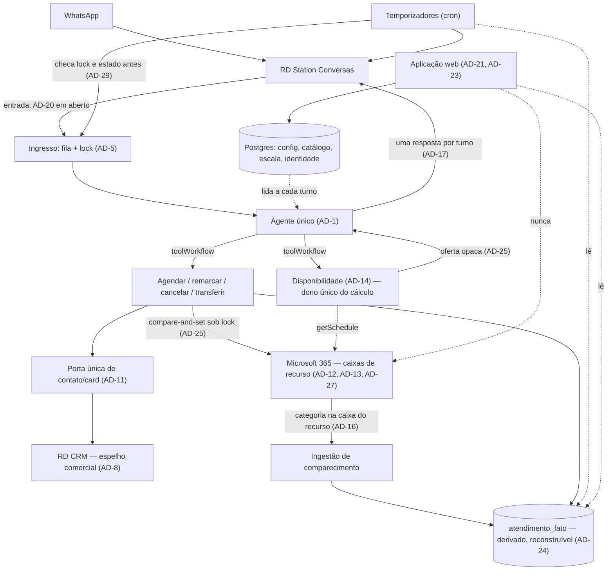
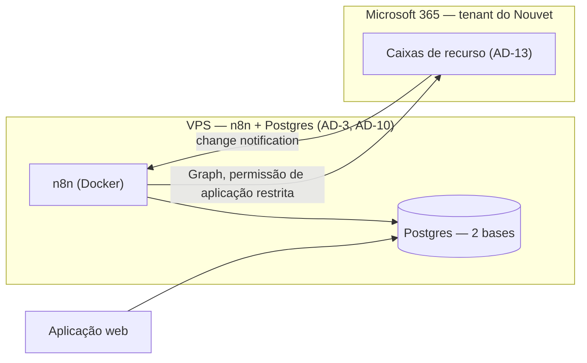

# Architecture Spine — Atendimento Nouvet (Agente que Agenda)

> Substitui a espinha do Piloto (`architecture-atendimento-2026-09-01`). **`AD-4` daquela espinha — "agente nunca faz checagem de agenda nem escreve nela" — está revogado**: era a premissa central do Piloto e caiu quando o Nouvet informou que não há equipe para a continuidade humana. Os demais `AD` do Piloto são herdados e **não re-decididos** (ver *Invariantes Herdados*). IDs nunca são renumerados.

## Design Paradigm

**Tool-Calling Agent Orchestrator sobre calendário como sistema de registro.** O agente continua sendo um único nó LangChain no n8n com `systemMessage` montado a partir de config lida a cada turno — mas agora **executa** a ação em vez de coletar e entregar a um humano. A mudança de paradigma não é o agente; é **onde a verdade mora**: a agenda sai do SimplesVet e passa a viver no Microsoft 365, e o agente escreve nela.

| Camada | Papel | Implementação |
| --- | --- | --- |
| Ingresso | Debounce + lock antes do agente ver a mensagem | Fila por telefone (`AD-5`), entrada pelo RD (`AD-20`, aberta) |
| Orquestração | Único ponto de decisão da conversa | `@n8n/n8n-nodes-langchain.agent`, prompt montado da config (`AD-1`) |
| Ferramentas | Uma ação = um sub-workflow | Buscar disponibilidade, agendar, remarcar, cancelar, transferir, registrar pedido de transporte |
| Registro | Onde a verdade mora | **Calendário Microsoft** (agenda, `AD-12`) · **Postgres** (escala, config, identidade, preferências, ponteiros) · **RD CRM** (ciclo comercial, espelho) |
| Administração | Configurar, escalar, medir | Aplicação web, fora do caminho do agendamento (`AD-21`) |

Três processos independentes rodam em paralelo, sem se chamar: a **conversa** (reativa, disparada por mensagem), os **temporizadores** (cron: lembrete, confirmação, recorrência) e a **ingestão de comparecimento** (reativa, disparada pelo Graph). Só a conversa fala com o cliente em tempo real.

## Invariantes Herdados

Vindos da espinha do Piloto, **binding e read-only** — não re-derivar:

| ID | Regra em uma linha |
| --- | --- |
| `AD-1` | Config-as-Data: toda regra de negócio vive em Postgres, lida a cada turno, nunca hardcoded, nunca cacheada; `systemMessage` montado seletivamente |
| `AD-2` | Credenciais só no cofre nativo do n8n, incluindo tokens rotativos; `N8N_ENCRYPTION_KEY` fixa |
| `AD-3` | Duas bases Postgres com privilégio mínimo; papel mais restrito para a tabela de PII |
| `AD-5` | Debounce + lock por sessão, com TTL de recuperação de lock travado |
| `AD-7` | Canal único de mensageria: RD Station Conversas |
| `AD-8` | RD Conversas e RD CRM são sempre duas integrações distintas; normalização de telefone centralizada em E.164 |
| `AD-10` | Stack pinada por tag completa, sem drift de versão |
| `AD-11` | Criação de contato/card e escrita de identidade: porta única, idempotente |
| `AD-6` | Postgres de identidade é complementar ao card do RD CRM, não substituto — **mantido**, e é quem dá dono a `FR-14` |
| `AD-9` | **Substituído por `AD-13` e `AD-23`**: o Piloto escopava a credencial de calendário como somente-leitura; o produto novo escreve. A intenção original (elevação deliberada de escopo) permanece na forma de escopo restrito por RBAC. |

## Invariants & Rules

### AD-12 — O calendário Microsoft é a fonte da verdade da agenda [ADOPTED]

- **Binds:** FR-10, FR-12, FR-16, FR-17, FR-38, NFR-3
- **Prevents:** (a) tabela local de agendamentos que espelha o calendário e diverge dele; (b) o SimplesVet continuar sendo consultado como agenda depois da virada; (c) a aplicação e o agente responderem coisas diferentes sobre o mesmo horário
- **Rule:** o calendário é a **única fonte de decisão**. Nenhum componente decide disponibilidade, oferece horário ou confirma agendamento a partir de dado guardado no Postgres — **essa é a regra, não "o Postgres não guarda horário"**. O Postgres guarda **fato derivado e reconstruível** (`AD-24`): o suficiente para temporizar, medir e reencontrar, nunca para decidir. Divergência entre fato e calendário resolve-se sempre pelo calendário, e o fato é reconstruível a partir dele. Nenhum componente consulta o SimplesVet em tempo de execução.

### AD-13 — Um calendário por recurso, não por pessoa [ADOPTED]

- **Binds:** FR-10, FR-12, FR-36
- **Prevents:** modelar a agenda por profissional quando a operação é por sala e equipamento — dos 54 recursos ativos, os de maior volume são salas (`Imagem1` tem mais compromissos que qualquer pessoa)
- **Rule:** cada recurso da operação (consultório, sala, equipamento, agenda nominal) é **uma caixa de recurso** do Exchange (*room* ou *equipment mailbox*), que não consome licença. O vínculo **serviço → recursos habilitados é config (1:N)**, nunca código. Um recurso novo entra criando caixa e linha de config — sem alterar fluxo.

### AD-14 — Escala é nossa; ocupação é do calendário [ADOPTED]

- **Binds:** FR-10, FR-38
- **Prevents:** tentar representar no Outlook o conceito de "este recurso está aberto neste dia", que ele não tem — o Exchange modela horário comercial semanal fixo, e a operação do Nouvet é rotativa (20–22 recursos por dia útil, 17 no sábado, 9 no domingo, planejada até set/2027)
- **Rule:** a **escala (recurso × dia)** vive no Postgres e é mantida na aplicação pelo Nouvet. O calendário responde apenas *"este intervalo está ocupado?"*. Disponibilidade é a interseção: `escala do dia` ∩ `janela do recurso` ∩ `grade e duração do serviço` − `ocupação lida do calendário`. **Esse cálculo existe em um único lugar** — o sub-workflow de disponibilidade —, nunca reimplementado por quem oferece horário e por quem confirma.

### AD-15 — Derivar uma vez, ser dono [ADOPTED]

- **Binds:** FR-1, FR-4, FR-5a, FR-40a
- **Prevents:** rotina de sincronização com um sistema sem API, que será substituído em cerca de um ano, produzindo duas fontes de verdade para a mesma preferência
- **Rule:** a importação do SimplesVet **normaliza uma vez** e nossa base passa a ser dona das preferências de atendimento; o SimplesVet segue dono do registro clínico. **Não existe rotina periódica** — a importação é capacidade acionada sob demanda (carga inicial, conferência eventual de porte) e **nunca sobrescreve campo de domínio próprio**. Divergência é mitigada na conversa: o agente confirma a preferência em uma linha a cada agendamento.

### AD-16 — Comparecimento entra por categoria + notificação do Graph [ADOPTED]

- **Binds:** FR-22a, O3
- **Prevents:** (a) inventar um estado de conclusão que o Graph não tem — o recurso `event` não possui `status` nem `completedDateTime`, e `showAs` modela disponibilidade, não ciclo de vida, de modo que sobrescrevê-lo corromperia a própria consulta de ocupação; (b) presumir comparecimento por ausência de sinal
- **Rule:** o sinal é a **categoria aplicada ao evento dentro da caixa do recurso** — categorias são **por caixa** e **não propagam** entre cópias do mesmo compromisso, então marcar na cópia pessoal não produz sinal algum. Decorre daí: (a) as categorias `Atendido` e `Faltou` são **provisionadas em cada caixa de recurso** no momento em que ela é criada, e isso faz parte do provisionamento, não do treinamento; (b) o gesto operacional válido é marcar **no calendário do recurso**; (c) há **uma assinatura por caixa** (~54), cada uma com expiração própria e renovação por job dedicado, com tabela de estado — "a assinatura" no singular é erro de modelagem. Notificação em `updated` **também dispara nas nossas próprias escritas**: todo consumidor descarta eco comparando com a última escrita conhecida. Quando a categoria não vier, o comparecimento fica **desconhecido** e o indicador reporta **cobertura**, nunca presume desfecho.

### AD-17 — Uma resposta por turno [ADOPTED]

- **Binds:** NFR-1, FR-21, FR-21a
- **Prevents:** dividir a resposta em várias mensagens para "parecer humano" — padrão comum nos templates de referência (`07 - Quebrar/Enviar Mensagens`) que, a partir de 01/10/2026, multiplica o custo por turno. **Não existe franquia gratuita nem faixa por volume para mensagem de serviço** (confirmado na doc da Meta): cada mensagem é custo direto, sempre
- **Rule:** o agente emite **exatamente uma mensagem por turno**. **A alavanca de custo é o tamanho do prompt, não o modelo**: a montagem seletiva de `AD-1` leva o prompt do Piloto de ~16 mil tokens para ~4 mil na onda 1, cortando o gasto por quatro em qualquer modelo. Maior ainda é o **cache de prefixo** — o prompt estável é reenviado a cada turno; se o node do n8n expuser cache, os turnos seguintes saem por uma fração. **Verificar isso é a pergunta de maior retorno do spike.** Quando uma operação demorar (`NFR-2` pede sinalizar em vez de silenciar), a sinalização vai **dentro da mesma mensagem** — *"deixa eu ver os horários"* nunca é uma mensagem separada. As duas regras não conflitam: `NFR-2` fala de **transparência**, `AD-17` de **quantidade**. Lembretes e mensagens proativas são turnos próprios, contabilizados. **Lembrete cujo momento já passou, ou que cairia perto demais do agendamento, é suprimido** — 42% dos banhos são marcados com menos de 24h de antecedência, então a supressão é o caminho comum, não a exceção.

### AD-18 — Preço é função, não valor [ADOPTED]

- **Binds:** FR-18, FR-19, FR-20
- **Prevents:** (a) preço hardcoded; (b) usar o catálogo de faturamento do SimplesVet como catálogo de serviço — ele mistura serviço com insumo (a categoria "Banho" tem 75 itens ativos, dois são serviço) e o preço varia por espécie, porte, pelo, plantão, profissional e plano; (c) o agente cotar o que depende de ver o animal
- **Rule:** existe um **catálogo próprio, curado e pequeno**, ligado aos itens de faturamento por referência. Cada serviço declara `modo_preco` — **fechado**, **tabela por variação** ou **depende de orçamento**. Quando a dimensão que determina o preço for **provisória** (porte informado pelo cliente, não confirmado pelo faturamento), a resposta sai **com ressalva**, nunca como valor firme. O que depende de julgamento humano (desembolo) nunca é cotado.

### AD-19 — Ondas são dado, não código [ADOPTED]

- **Binds:** PRD §3.2
- **Prevents:** branch, flag de build ou deploy por onda de entrega
- **Rule:** cada serviço do catálogo declara a `onda` em que entra. Ligar a onda seguinte é **mudar dado** — nunca publicar versão. O agente oferece apenas serviços da onda ativa e trata os demais como fora de escopo, conduzindo à transferência.

### AD-20 — Entrada pelo RD Conversas [OPEN]

- **Binds:** FR-6, FR-7
- **Prevents:** (a) decidir por conta própria uma integração cuja forma recomendada só o fornecedor conhece; (b) — e este é o invariante que vale **independente da escolha** — o mecanismo de entrada vazar para as camadas de baixo, obrigando a refazer agente, ferramentas ou registro quando a forma mudar
- **Rule:** a camada de ingresso é **substituível**. Nada abaixo dela pode depender do mecanismo: o agente recebe sempre o mesmo contrato — *identificação do contato, texto agregado do turno e estado da conversa* — e devolve sempre uma resposta (`AD-17`), sem saber se foi chamado por webhook ou por requisição síncrona. Toda particularidade do transporte (estado do `action`, janela de timeout, agregação de mensagens picadas) morre no ingresso. Enquanto a forma não estiver decidida, vale o plano de fundo abaixo.
- **Status:** **aberta até a reunião com o RD Station.** Três opções em `_bmad-output/planning-artifacts/rd-conversas/2026-09-15-fork-webhook-vs-requisicao-externa.md`: **(A)** webhook assíncrono, **(B)** requisição externa síncrona dentro do fluxo do RD, **(C)** híbrida (handshake no fluxo, conversa por webhook).
- **Plano de fundo adotado:** **(A)**, que o Piloto já exercitou. O restante da arquitetura **não depende desta escolha** — ela troca a camada de ingresso, não o agente, as ferramentas nem o registro.
- **Consequência se (B) vencer:** a máquina de estados `bot | aguardando_humano | humano` deixa de ser necessária, e o handoff passa a ser nativo. É simplificação, não retrabalho estrutural.

### AD-21 — A aplicação é superfície de administração, não caminho do agendamento [ADOPTED]

- **Binds:** FR-34–FR-41
- **Prevents:** (a) o agente depender da aplicação em tempo de execução, criando acoplamento entre a conversa e uma interface web; (b) a aplicação virar um segundo ponto de escrita no calendário, quebrando `AD-12`
- **Rule:** a aplicação lê e escreve **config, escala, catálogo e indicadores no Postgres**, e mais nada. **Não fala com o cliente e não escreve no calendário.** O único componente que escreve no calendário é o n8n. Se a aplicação cair, o agente continua atendendo com a última config gravada.

### AD-22 — Emergência é caminho separado do agendamento [ADOPTED]

- **Binds:** FR-27
- **Prevents:** emergência virar "mais um tipo de serviço" e receber tratamento de agendamento — dos 734 atendimentos emergenciais, 98% foram registrados na hora ou depois; ninguém marca uma emergência
- **Rule:** o reconhecimento de emergência **interrompe** o que estiver em curso, **não oferece horário**, orienta a vir imediatamente e alerta os destinatários configurados (`AD-1`). Vale em qualquer ponto de qualquer conversa, em todas as ondas, e tem precedência sobre qualquer outra instrução do prompt.

### AD-23 — Identidade da aplicação separada da identidade do agente [ADOPTED]

- **Binds:** FR-41, NFR-5
- **Prevents:** uma credencial única servindo o agente e a aplicação, ampliando o raio de um vazamento
- **Rule:** **dois registros de aplicativo** no Entra ID. O do **agente** usa permissão **de aplicação** (`Calendars.ReadWrite`, `MailboxSettings.Read`) — obrigatória, não preferência: permissão delegada é incapaz de assinar caixa de terceiro — restrita por **RBAC for Applications** (escopo de gerenciamento sobre o grupo das caixas), **não** por *Application Access Policy*, que a Microsoft classifica como legada. O da **aplicação web** usa permissão delegada (`User.Read`) e autoriza por papel, com a matriz papel → permissão vivendo como **dado**. **Restrição do tenant:** o Nouvet está em Entra ID Gratuito — App Roles funcionam, mas **atribuição por grupo exige P1**, então a atribuição é **usuário a usuário**; e *Conditional Access* também exige P1, logo não é um risco neste tenant.

### AD-24 — Fato de agendamento: derivado, reconstruível, nunca decisório [ADOPTED]

- **Binds:** FR-21, FR-21a, FR-23a, FR-38, FR-39, NFR-7
- **Prevents:** a pinça que inviabilizava três capacidades — `AD-21` manda a aplicação ler só o Postgres, `AD-12` tira a agenda do Postgres e `AD-15` proíbe rotina de importação. Sem esta regra, **indicadores, recorrência e lembrete são inconstruíveis**: o cron não sabe quando lembrar, a aplicação não tem o que mostrar e ninguém sabe quando foi o último banho do Bidu
- **Rule:** existe **uma tabela de fato append-only** (`atendimento_fato`) que registra o que aconteceu — agendado, remarcado, cancelado, lembrado, confirmado, compareceu, faltou —, cada linha com **carimbo de tempo do evento de negócio**, identificação do recurso, do serviço, do pet e do telefone. Ela é **derivada**: toda linha pode ser reconstruída a partir do calendário e das notificações do Graph, e sua perda é recuperável. É a **única** fonte permitida para temporizadores, indicadores e recorrência. **Nunca é consultada para decidir disponibilidade** — isso continua sendo `AD-12`. Contém horário porque **medir e temporizar exigem horário**; o que ela não faz é decidir.

### AD-25 — Oferta é objeto opaco; agendar é compare-and-set [ADOPTED]

- **Binds:** FR-10, FR-11, FR-12, FR-16
- **Prevents:** o caminho mais provável de furo duplo que a espinha tinha. Duas unidades — *Disponibilidade* e *Agendar* — obedeciam todos os `AD` e ainda assim geravam agendamento duplo: (a) se a disponibilidade **deduplica por horário** entre os três recursos de banho, quem agenda **reescolhe o recurso** com critério próprio, sem consultar escala; (b) o lock de `AD-5` é **por sessão**, não por recurso, e não serializa dois clientes disputando o mesmo intervalo; (c) **escrita direta em caixa de recurso por permissão de aplicação não passa pelo assistente de reserva do Exchange** — o recusar-automático atua sobre convite, não sobre gravação direta; (d) *retry* do Graph duplica evento
- **Rule:** a disponibilidade devolve **objetos opacos de oferta** — `(recurso, início, fim, versão da configuração, expira em)` — e quem agenda **consome verbatim**: nunca reinterpreta, nunca reescolhe recurso, nunca recalcula horário. Agendar é **compare-and-set**: sob lock por `(recurso, intervalo)`, relê a ocupação do calendário, e só então grava. Toda escrita no calendário carrega **chave de idempotência** para absorver *retry*. Se a oferta expirou ou a ocupação mudou, o agendamento falha e o agente oferece de novo — **nunca grava sobre dúvida**.

### AD-26 — Recurso só é elegível depois de migrado [ADOPTED]

- **Binds:** FR-10, migração do calendário
- **Prevents:** durante a virada — que é **por recurso** e roda em paralelo às ondas — um recurso ainda não migrado tem calendário vazio no Microsoft 365 e ocupação real no SimplesVet; o agente leria "livre" e ofereceria horário ocupado. `AD-19` controla elegibilidade **por serviço** e não cobre isso
- **Rule:** cada recurso carrega um estado de migração. **Só recurso `migrado` entra no cálculo de disponibilidade.** Serviço cujos recursos não estejam todos migrados **não é ofertável**, ainda que sua onda esteja ativa — a onda habilita o serviço, a migração habilita o recurso, e as duas condições valem juntas. Reverter um recurso para `não migrado` é operação suportada, não incidente.

### AD-27 — Topologia do evento: o recurso é o dono [ADOPTED]

- **Binds:** FR-12, FR-16, FR-22a
- **Prevents:** duas topologias possíveis e incompatíveis — gravar direto na caixa do recurso (recurso é organizador) **ou** criar reunião na caixa de uma pessoa convidando a sala. Elas têm políticas de conflito opostas, e a segunda quebra `AD-16` em silêncio, porque a categoria marcada na cópia da pessoa nunca chega à caixa assinada
- **Rule:** o evento é **criado na caixa do recurso, que é o organizador**. Não há convidado, não há cópia em caixa pessoal. Quem precisa ver a agenda **abre o calendário do recurso** — compartilhado com quem precisar. Isso mantém um único lugar onde o compromisso existe, um único lugar onde a categoria vale (`AD-16`) e um único dono da proteção contra conflito (`AD-25`).

### AD-28 — Reancoragem: o ponteiro sobrevive ao humano [ADOPTED]

- **Binds:** FR-17, FR-21, FR-22a
- **Prevents:** `event_id` do Graph é **escopado à caixa** — se alguém arrastar o compromisso de um recurso para outro no Outlook, o identificador muda e o vínculo telefone→evento se perde. Como o ponteiro é o único índice, "resolver pelo calendário" deixa de ser possível justamente quando mais se precisa
- **Rule:** todo evento criado pelo agente carrega uma **chave própria e estável**, gravada no próprio evento (extensão ou identificador de correlação), independente da caixa em que ele esteja. A reconciliação procura por essa chave, não pelo `event_id`. Quando um evento muda de caixa, o fato (`AD-24`) é atualizado a partir da chave e o ponteiro reancorado — **sem intervenção**. Evento com chave desconhecida é tratado como **externo**: ocupa horário, mas não pertence ao agente e nunca é alterado por ele.

### AD-29 — Temporizador não atropela conversa humana [ADOPTED]

- **Binds:** FR-21, FR-23a, FR-29, O5
- **Prevents:** os temporizadores são um processo independente que fala direto com o cliente. Sem esta regra, um lembrete dispara no meio de uma conversa que um atendente humano está conduzindo — exatamente a falha que o Piloto já cometeu em produção
- **Rule:** antes de qualquer mensagem proativa, o temporizador **verifica o estado da conversa** e **respeita o mesmo lock** que a conversa usa (`AD-5`). **Posse da conversa não é pré-requisito para enviar** — mensagem proativa sai por API com a conversa fechada, e é por isso que é template. O que a regra proíbe é enviar **enquanto há humano em atendimento**. Conversa em atendimento humano, ou com lock ativo, **adia** — nunca envia em paralelo. Além disso, nenhuma mensagem proativa é enviada sobre agendamento já resolvido, e **toda mensagem proativa fora da janela de 24 horas é um template aprovado**, com categoria declarada (`FR-24`) — o que também torna o custo previsível por tipo de disparo.

### AD-30 — Ambientes: nada de ensaio em produção [ADOPTED]

- **Binds:** NFR-4, NFR-5, NFR-6
- **Prevents:** a dimensão inteira que a primeira versão desta espinha deixou em silêncio. O produto novo **escreve em calendário real e manda mensagem para cliente real** — sem separação, desenvolver significa criar compromisso na agenda que a recepção usa e mandar WhatsApp para tutor de verdade. O Piloto já viveu isso, respondendo por cima de uma atendente
- **Rule:** existe **ambiente de desenvolvimento com identidade própria**: caixas de recurso próprias (nunca as de produção), credencial de aplicação própria, e **canal de mensageria que não alcança cliente real**. Nenhum componente aponta para recurso de produção fora do ambiente de produção, e a distinção é de **configuração**, não de disciplina de quem executa. Enquanto não houver canal de teste, **o ambiente de desenvolvimento não envia mensagem** — registra o que teria enviado.

### AD-31 — Falha silenciosa é defeito, não estado [ADOPTED]

- **Binds:** NFR-4, NFR-7, O3
- **Prevents:** os modos de falha novos são todos **silenciosos e indistinguíveis de operação normal**: assinatura do Graph expirada parece "ninguém marcou categoria"; notificação descartada por não responder em três segundos some sem rastro; template rejeitado só aparece no painel; escrita no CRM é *fire-and-forget* por desenho
- **Rule:** todo mecanismo que pode falhar sem produzir erro visível carrega um **sinal de vitalidade** — última notificação recebida por caixa, validade de cada assinatura, idade do último fato de comparecimento. **Ausência prolongada de sinal é alarme**, não silêncio aceito. Nenhum indicador apresenta número sem apresentar também sua **cobertura**: "70% de comparecimento sobre 40% dos agendamentos medidos" é honesto; "70% de comparecimento" é mentira por omissão.

### AD-32 — Escopo de autorização é o tutor, não o telefone [ADOPTED]

- **Binds:** FR-1, FR-17, FR-17a, FR-17b, FR-33, NFR-6
- **Prevents:** duas divergências que nascem juntas. (a) A ferramenta de cancelar e a de consultar poderiam escopar diferente — uma por telefone, outra por pet — e um número desconhecido que cite o nome do pet obteria confirmação de que o agendamento existe. (b) Pior: o agente, sendo prestativo, **confirma rotina alheia** — *"o banho do Bidu é amanhã às 10h"* dito a quem não é o tutor expõe o horário em que uma casa fica vazia. Nenhum `AD` anterior impedia isso
- **Rule:** o telefone da conversa resolve para **um tutor** (`identidade_tutor.telefones`, que é lista). **Toda leitura e toda escrita sobre agendamento são escopadas a esse tutor** — a mesma regra vale para cancelar, remarcar, consultar e mencionar. O agente **nunca confirma nem nega** a existência de agendamento fora desse escopo: responde que não localizou agendamento naquele número e oferece os dois caminhos legítimos. Telefone que não resolve para tutor algum, ou que resolve para mais de um, é tratado como **não autorizado** — o padrão seguro é recusar, nunca adivinhar. **O agente nunca acrescenta telefone a um cadastro**: vincular número é ação de humano ou de número já autorizado, porque um número não verificado pedindo para ser incluído é exatamente o formato de um ataque de engenharia social.

### Diagrama de dependência



O agente fala com `Cfg`, `Disp` e `Tools` — nunca com `Cal`, `CRM` ou `App` diretamente. A aplicação **lê** config e fato, e **nunca** toca o calendário. O cálculo de disponibilidade tem dono único, e sua saída é consumida verbatim. Os temporizadores passam pelo mesmo lock da conversa antes de falar com o cliente.

## Consistency Conventions

| Concern | Convention |
| --- | --- |
| Workflows | Prefixo numérico por papel (`00 - Configurações`, `01 - Agente`, `02+` sub-workflows), como no Piloto |
| Tabelas | `snake_case` em português, prefixo `atendimento_` para negócio, `identidade_` para PII, `n8n_` para plumbing |
| Recursos e caixas | `Agenda - <Recurso>` / `agenda.<slug>@nouvet.com.br`; o slug é a chave estável entre Postgres e Exchange |
| Telefone | E.164 canônico, normalização centralizada (`AD-8`) |
| Fuso | `America/Sao_Paulo` em toda leitura e escrita de calendário; nunca UTC implícito |
| Preferência do pet | Todo campo derivado carrega `origem` (`faturamento` \| `cliente` \| `importado`); `cliente` é provisório e força ressalva (`AD-18`) |
| Escrita no CRM | Sempre *fire-and-forget* com saída de erro registrada; jamais bloqueia o agendamento (`NFR-3`) |
| Falha | Erro no caminho do agendamento vira mensagem honesta ao cliente e registro para a equipe — nunca silêncio (`NFR-4`) |

## Stack

| Name | Version |
| --- | --- |
| n8n (self-hosted) | `n8nio/n8n:2.14.2` — literal já presente no `docker-compose.yml` do repositório. ⚠️ **n8n 3.0, com breaking changes, está previsto para outubro de 2026** — a janela do prazo. Atualizar é decisão datada, nunca efeito colateral de recriar container (`AD-10`) |
| PostgreSQL | `postgres:16.15-alpine3.24` — literal já no `docker-compose.yml` |
| Modelo de linguagem | **[ASSUMPTION] a decidir por medição, não no papel.** Acesso pelo **OpenRouter** (uma credencial serve Anthropic e OpenAI — trocar de modelo é mudar um campo). Candidatos e preço por milhão de tokens em 18/09/2026: **GPT-5.6 Luna** $0,20/$1,20 · **Claude Haiku 4.5** $1/$5 · **Claude Sonnet 5** $2/$10 · *(Opus 5 $5/$25 só se os três falharem)*. GPT-4.1 e GPT-5 são **legado** — não entram. **Custo não é o critério**: no volume da onda 1 a diferença entre o mais barato e o mais caro é da ordem de US$ 50/mês, muito abaixo do custo das mensagens na Meta. O critério é **confiabilidade de chamada de ferramenta** |
| Runtime | Docker / Docker Compose |
| Agente | n8n LangChain (`@n8n/n8n-nodes-langchain.agent`) |
| Mensageria | RD Station Conversas (API v2) |
| CRM | RD Station CRM (REST, OAuth2) |
| Calendário | Microsoft 365 / Graph — caixas de recurso, permissão de aplicação restrita por **RBAC for Applications** (*Application Access Policy* é legada: a Microsoft orienta a não criar configuração nova com ela) |
| Aplicação web | `[ASSUMPTION]` Next.js (linha 16.x; a 15 chega ao fim de vida em 21/10/2026). **A biblioteca de autenticação não está decidida** — `next-auth`/Auth.js v5 **nunca saiu de beta** e o projeto mudou de mantenedor, então não é a escolha reflexa; alternativas correntes são Better Auth e MSAL Node. *Alternativa de arquitetura considerada:* formulário no próprio n8n — resolve config, mas não entrega escala editável nem indicadores com papel. **Decisão do Thiago, ainda não tomada.** |

## Structural Seed

```
n8n/
  workflows/     # exports .json (00 - Configurações, 01 - Agente, 02+ ações)
  migrations/    # SQL versionado do banco da aplicação
  seed/          # config e catálogo iniciais
app/             # aplicação web (config, escala, indicadores)
import/          # rotinas de importação do SimplesVet (AD-15)
docker-compose.yml
```

### Tabelas do banco da aplicação

| Tabela | Papel |
| --- | --- |
| `atendimento_config` | Singleton de personalização — tom, dados institucionais, limiares, destinatários (`AD-1`) |
| `atendimento_recurso` | Recurso, caixa Exchange, janela de funcionamento, ativo |
| `atendimento_escala` | `(recurso, data)` — a escala rotativa (`AD-14`) |
| `atendimento_servico` | Catálogo curado com os atributos do modelo de cadastro, incluindo `onda` (`AD-18`, `AD-19`) |
| `atendimento_servico_recurso` | Quais recursos executam qual serviço (N:N, `AD-13`) |
| `atendimento_preco` | Matriz de variação por dimensão (`AD-18`) |
| `identidade_tutor` | Nome, telefones, endereços (lista, com ponto de retirada), origem, cadastro incompleto |
| `identidade_pet` | Espécie, raça, nascimento, plano, porte e tipo de pelo **com `origem`**, preferências, observação livre |
| `atendimento_fato` | Append-only, derivado e reconstruível: agendado, remarcado, cancelado, lembrado, confirmado, compareceu, faltou — com carimbo de tempo, recurso, serviço, pet e telefone (`AD-24`). Única fonte de temporizadores, indicadores e recorrência |
| `agendamento_ponteiro` | Chave estável de correlação + `event_id` corrente + telefone, pet, serviço e estado conversacional; reancorado pela chave quando o evento muda de caixa (`AD-28`) |
| `atendimento_recurso_migracao` | Estado de migração por recurso — só `migrado` entra na disponibilidade (`AD-26`) |
| `graph_assinatura` | Uma linha por caixa: identificador, validade, última notificação recebida (`AD-16`, `AD-31`) |
| `n8n_fila_mensagens`, `n8n_status_atendimento`, `n8n_historico_mensagens` | Plumbing herdado (`AD-5`) |

### Envelope de deployment



O endpoint de webhook do Graph precisa ser HTTPS público e alcançável a partir da Microsoft — restrição de rede ou *Conditional Access* que o bloqueie inviabiliza `AD-16`.

## Capability → Architecture Map

| PRD | Sustentado por |
| --- | --- |
| Identificação e contexto (FR-1–FR-5a) | `AD-11`, `AD-15`, `AD-8`, `AD-32` |
| Entendimento do pedido (FR-6–FR-9) | `AD-1`, `AD-5`, `AD-19` |
| Disponibilidade e agendamento (FR-10–FR-17b) | `AD-12`, `AD-13`, `AD-14`, `AD-25`, `AD-26`, `AD-27`, `AD-28`, `AD-32` |
| Preço (FR-18–FR-20) | `AD-18`, `AD-1` |
| Lembrete e confirmação (FR-21–FR-24) | `AD-17`, `AD-16`, `AD-24`, `AD-29` |
| Transporte (FR-25–FR-26) | `AD-19` (registra, não agenda) |
| Transversais (FR-27–FR-33) | `AD-22`, `AD-1`, `AD-8` |
| Configuração (FR-34–FR-37) | `AD-1`, `AD-21` |
| Operação e visibilidade (FR-38–FR-41) | `AD-14`, `AD-16`, `AD-21`, `AD-23`, `AD-24`, `AD-31` |
| Ambientes e operação (NFR-4–NFR-7) | `AD-30`, `AD-31` |

## Deferred

- **Forma de entrada pelo RD** (`AD-20`) — decidida na reunião; plano de fundo é o webhook.
- **Modelo de linguagem** — spike de medição, não escolha no papel. Medir, nas mesmas cinco conversas de banho: (1) chamou a ferramenta certa com os parâmetros certos; (2) respeitou o objeto de oferta de `AD-25` sem reescolher recurso nem inventar horário; (3) latência por turno — **limite duro** se `AD-20` fechar na opção síncrona; (4) aderiu a `AD-17`. Erro de modelo **não gera agendamento duplo**, porque `AD-25` revalida no commit — o que permite escolher um modelo mais barato com segurança.
- **Cache de prompt no node do n8n** — existe? É a maior alavanca de custo e não está confirmada.
- **Biblioteca de autenticação da aplicação** — `next-auth` v5 nunca saiu de beta; avaliar Better Auth ou MSAL Node.
- **Comportamento do assistente de reserva do Exchange** em escrita direta por permissão de aplicação — `AD-25` assume que **não** protege e resolve por conta própria. Confirmar no spike; se proteger, é defesa extra, nunca substituta.
- **Granularidade de `getSchedule`** frente a durações que não são múltiplo da grade (banho com mediana de 75 minutos, `QA-2`).
- **Templates aprovados** (`FR-24`) — autoria e aprovação são no painel do RD, com prazo da Meta; a categoria do template de recorrência provavelmente será *marketing*, com teto por usuário.
- **Stack da aplicação web** — proposta acima, não confirmada.
- **Migração dos 3.119 agendamentos futuros e 6.642 linhas de escala** para o Microsoft 365 — é trilha própria, paralela às ondas do agente; a virada é por recurso, não por data única. Mecanismo, ordem dos recursos e janela ainda não definidos.
- **Backup e restauração** dos dois bancos e do calendário — herdado como pendência do Piloto, ainda sem cadência nem teste de restauração.
- **Reoferta do horário liberado** quando um cliente cancela no lembrete de 24h — o mecanismo existiria, mas não foi desenhado.
- **Observabilidade além do sinal de vitalidade de `AD-31`** — saúde de n8n e Postgres, alerta de fila parada, painel operacional: sem mecanismo definido.
- **Multimodal** (áudio e imagem do cliente) — o padrão de referência existe; fora do escopo das ondas 1 a 3.
- **Retenção e exclusão de PII** — a base de identidade é permanente; obrigação de LGPD ainda sem política definida.
